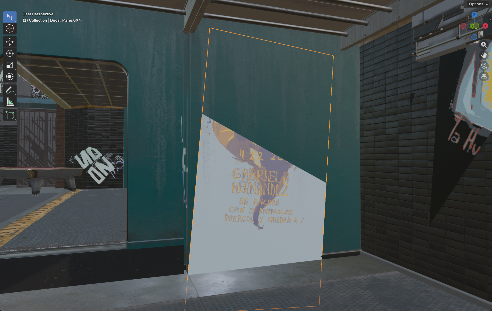
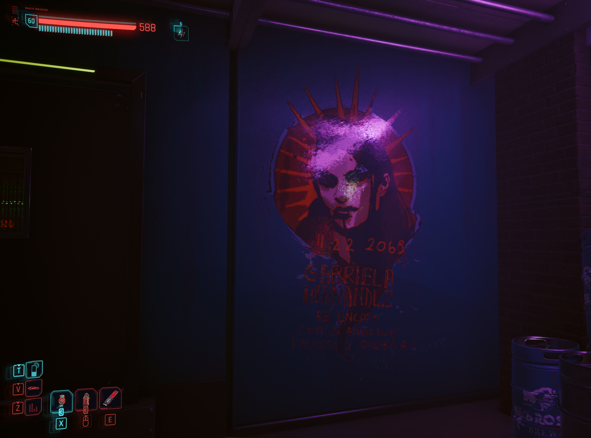
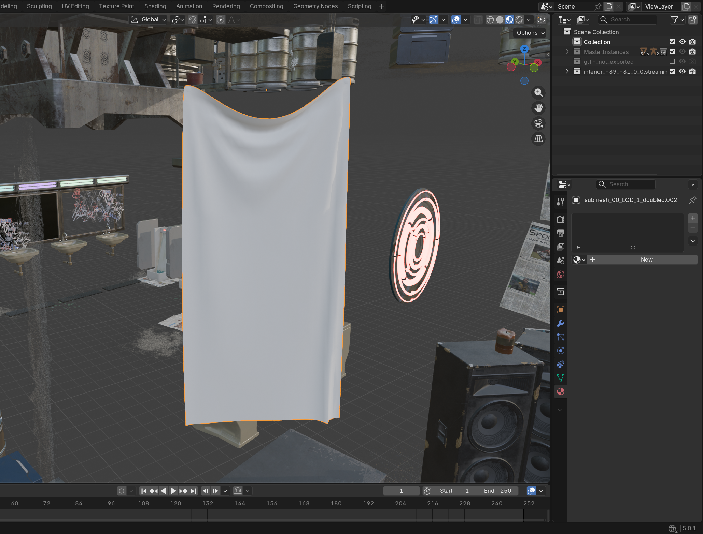
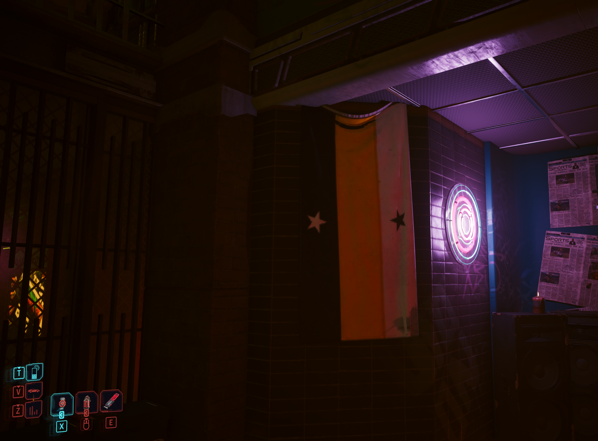
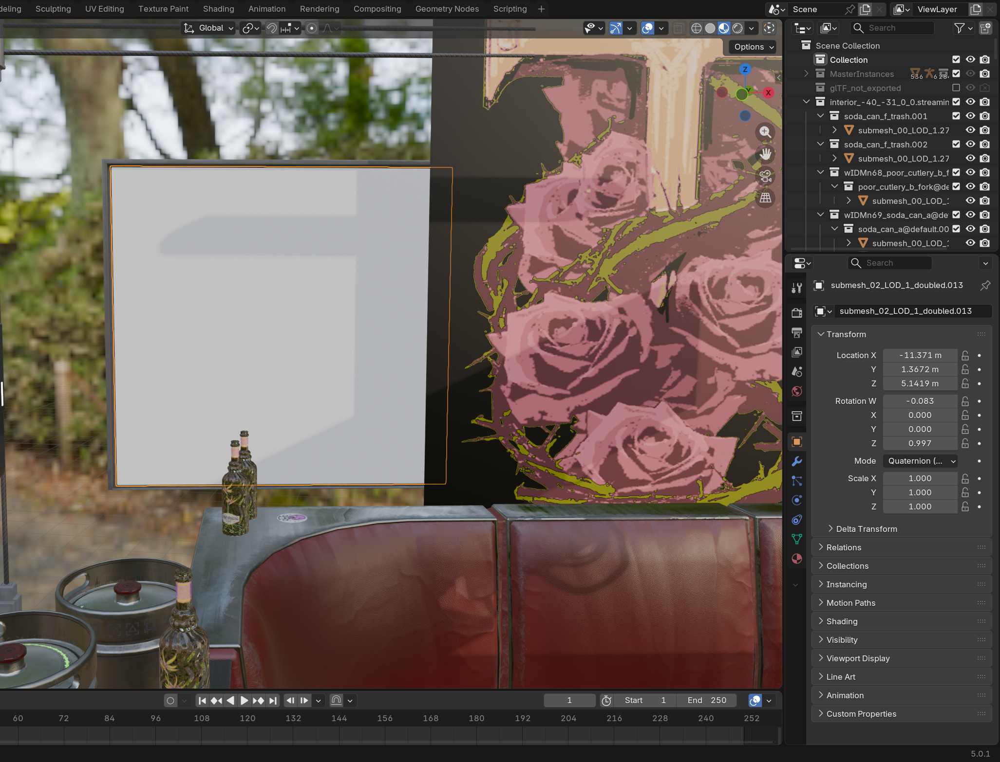
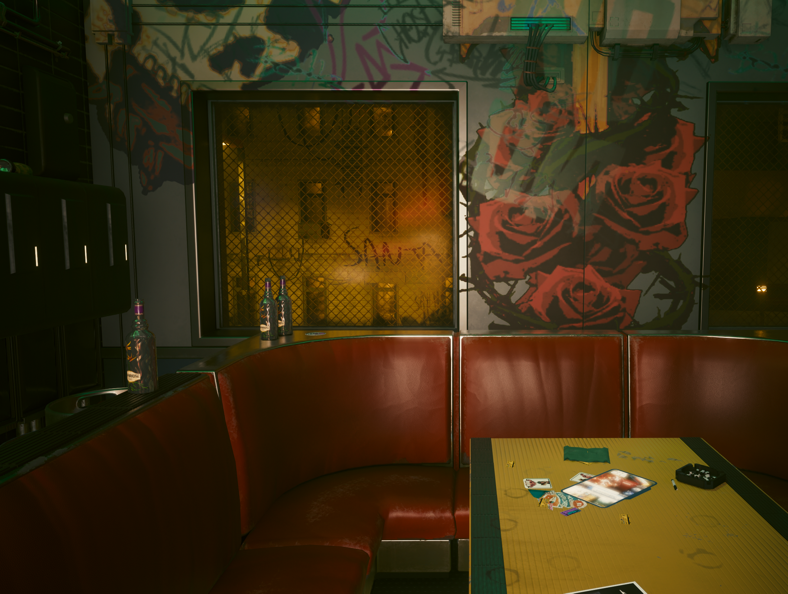
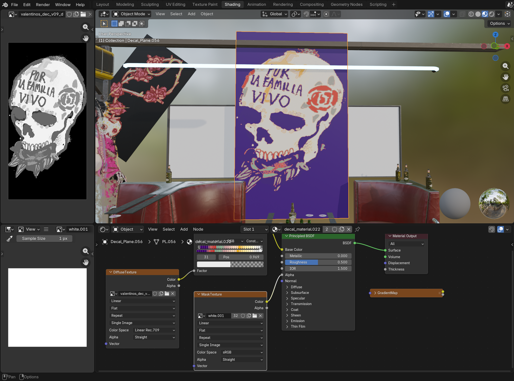
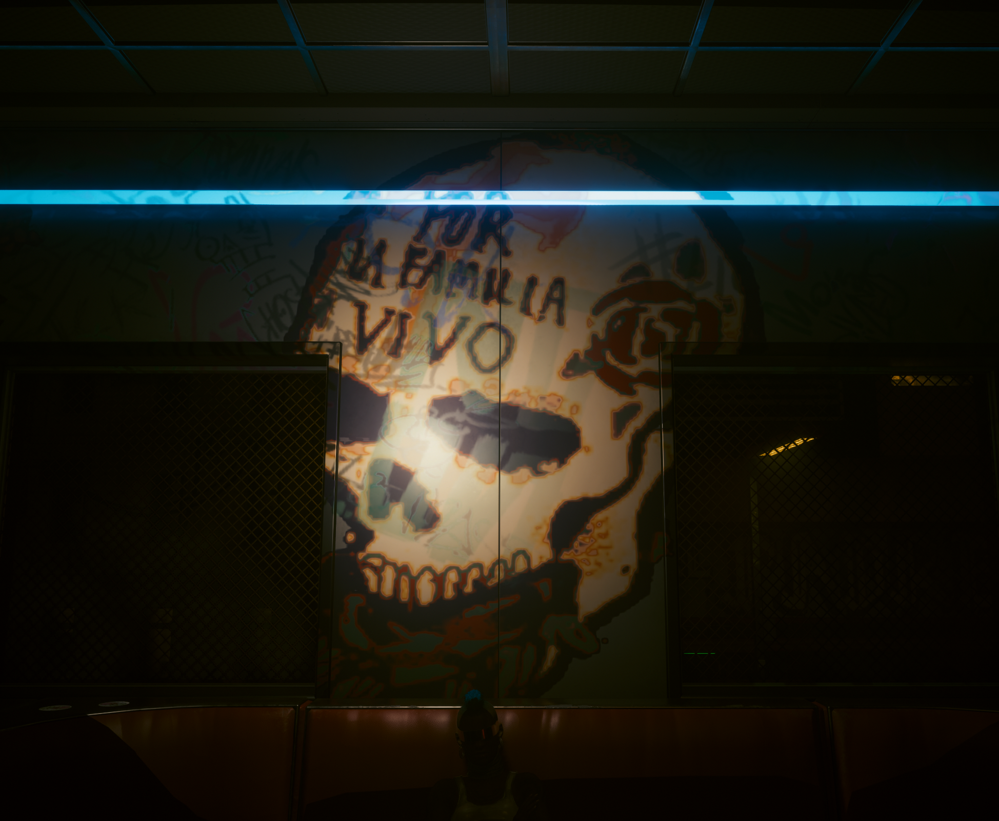

# Bug reports

## Misc

### Sectors

All used sectors: `interior_-20_-16_0_1|interior_-39_-31_0_0|interior_-39_-32_0_0|interior_-40_-31_0_0|interior_-40_-32_0_0`

Sector `interior_-20_-16_0_1`: Contains the bulk of the interior; Around 50% of upstairs furniture, Large objects such as the pool table, and the overall layout of the bar
Sector `interior_-39_-31_0_0`: Contains primarily metal containers, speakers, and bathroom fixtures; The North East section of the bar
Sector `interior_-39_-32_0_0`: Contains primarily gameplay objects such as the Arcades or Pool Cues, as well as many bottles and the same metal containers
Sector `interior_-40_-31_0_0`: Contains primarily newspaper sheets, upstairs seating, and lighting fixtures; The North entrance of the bar
Sector `interior_-40_-32_0_0`: "Sector E"

### General Instructions

1. Start with an empty WolvenKit project
2. Search for the intended sector in the Asset Browser
3. Select the sector and add it to the project
4. Navigate to Toolbar > Tools > Script > Script Manager, and run `Export_Sector`
5. Wait for the script to finish (keep an eye on resource usage)
6. Open blender and navigate to Toolbar > File > Import > Cyberpunk StreamingSector and choose the `.cpmodproj` file in the root of your project
7. Wait for the import to finish
8. Navigate to Outliner > View Layers > Search for the object name > Select the object (continued)
9. Navigate to Header > View > Frame Selected
10. Bonus! I find it easiest to navigate using F3 > Search for "Walk navigation" > Press Enter > Press Tab

## Bugs

### 1. Decals are rotated such that they clip into the surface they're supposed to rest on

- Example Sector: `interior_-20_-16_0_1`
- Example Objects:
  - `Decal_Plane.094`
  - `Decal_Plane.068`
  - `Decal_Plane.028`

All decals are rotated and positioned such that they are not flush with the surface they're supposed to rest on, thus causing some to clip through the surface, and others to float above it.
Some tolerance is to be expected to eliminate Z-fighting, but not rotated into the surface such as what is being observed here.

 

### 2. Cloth surfaces are not textured (no material assigned)

- Example Sector: `interior_-39_-31_0_0`
- Example Objects:
  - `submesh_00_LOD_1_doubled.002`

All cloth surfaces are not textured, and are instead assigned no material. These seem to be flags in-game, hung up inside the bar.

 

### 3. Surfaces such as windows and some floor sections have a second surface above with no material

- Example Sector: `interior_-40_-31_0_0`
- Example Objects:
  - `submesh_02_LOD_1_doubled.012`: The second surface above the window with no material
  - `submesh_01_LOD_1.500`: The window itself with the `z_glass_atlantis_yellow.001` or similar material
  - `submesh_02_LOD_1_doubled.013`: Second surface
  - `submesh_01_LOD_1.501`: The window itself

The second surface above the window is almost certainly the metal wire or "bars" on the window.

 

### 4. Many decals had improperly applied alpha mattes

- Example Sector: `interior_-40_-31_0_0`
- Example Objects:
  - `Decal_Plane.056`
  - `Decal_Plane.065`
  - `Decal_Plane.019`

Some decals, for some reason, use a "white.001" texture plugged into the alpha matte slot, when the decal is not intended to have a solid background. I believe using the "DefuseTexture" (in .056's case, `valentinos_dec_v05_d`) as the alpha matte is exactly what the game itself does.

 

